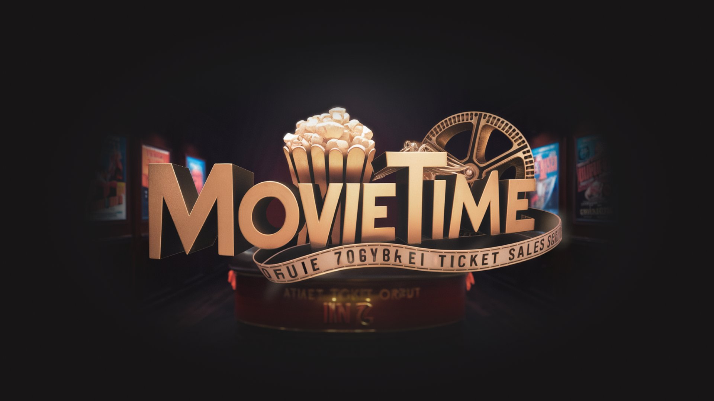
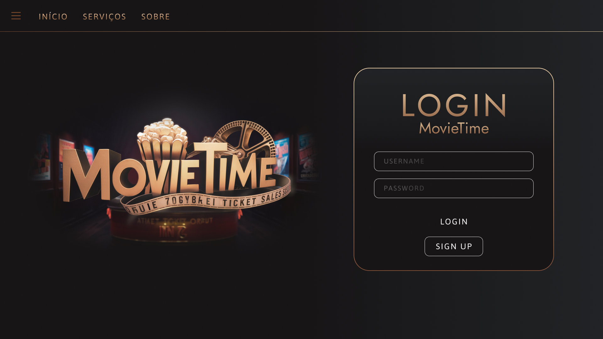
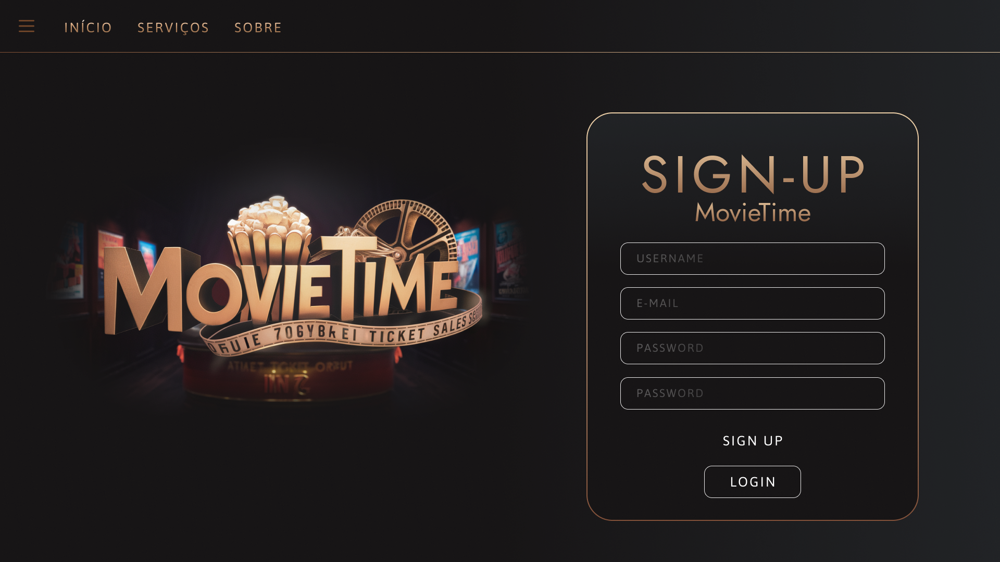
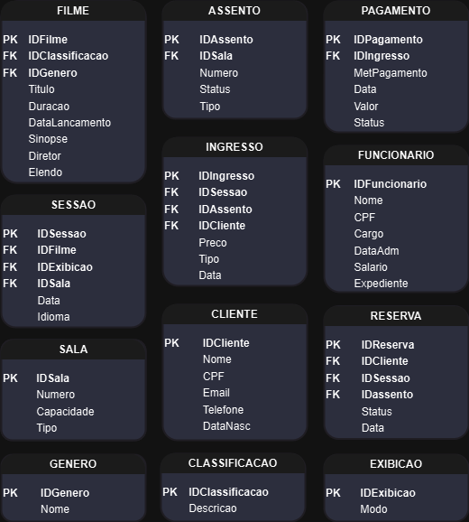
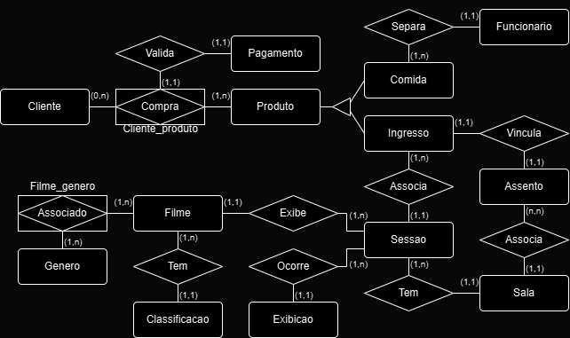

<h1>projeto-bd-bilheteria</h1>

O projeto está em desenvolvimento

  <a href="https://www.figma.com/design/V4RhBN3K4GfRbJSls3Xcdl/Untitled?node-id=0-1&t=QMqTKKcGXasHVvPC-1">Figma Link</a>
  

    Splash Page
    
    Login Page
    
    Sign Up Page
    
    Main Page
    
  

  

Entidades do projeto.

<a href="Bilheteria.drawio" download="Bilheteria.drawio">Baixar Arquivo Draw.io</a>

Diagrama Conceitual

